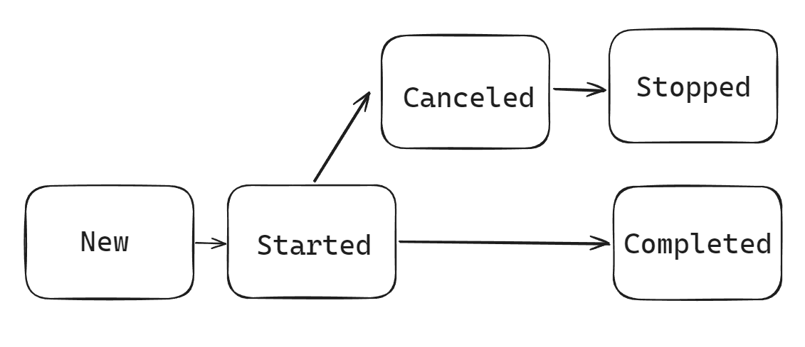

 ## Stateful scheduler


Schedule stateful jobs, which contain additional execution state information.

Configuration example:

```java
@Configuration
class TaskSchedulerConfiguration {

    @Bean
    public TaskScheduler threadPoolTaskScheduler() {
        var taskScheduler = new ThreadPoolTaskScheduler();
        taskScheduler.setPoolSize(8);
        taskScheduler.setAwaitTerminationSeconds(40);
        taskScheduler.setWaitForTasksToCompleteOnShutdown(true);
        return taskScheduler;
    }

    @Bean
    public StatefulTaskScheduler statefulTaskScheduler() {
        return new StatefulTaskSchedulerImpl<>(threadPoolTaskScheduler());
    }
    
}
```

Usage example: 

```java
@Component
class MyJob implements NamedJob {
    
    @Override
    public String getName(){
        return "MyJob";
    };
    
    @Override
    public void run() {
        // job's logic
    }
    
}

@Slf4j
@Service
class MyStatefulJobSchedulerServiceImpl extends BaseStatefulJobSchedulerService<NamedJob> {

    public MyStatefulJobSchedulerServiceImpl(StatefulTaskScheduler taskScheduler, Map<String, NamedJob> jobs, Logger logger) {
        super(taskScheduler, jobs, log);
    }

}

/*
 * Inject MyStatefulJobSchedulerServiceImpl or StatefulJobSchedulerService to operate on available NamedJobs
 * in the scheduler, or register your own dynamically with a given name.
 * 
 * Available operations:
 *  + Schedule job (returns StatefulScheduledFuture).
 *  + Cancel Job.
 *  + Get jobs information (which includes its name, execution state, Thread.State, elapsed time, run time, is cancelled).
 *  + Get all jobs (name-NamedJob).
 *  + Get a job by name.
 *  + You can extend this list as you wish :)
 */
```

### Execution states


Fig. 1 Execution State transition

* New - The job is scheduled but not yet running.
* Started - The job is currently running.
* Cancelled - The job has been cancelled and will not be rescheduled, but it is still running.
* Stopped - The job fully stopped upon cancellation and may have been interrupted or completed normally.
* Completed - The job has been completed and is no longer running.

